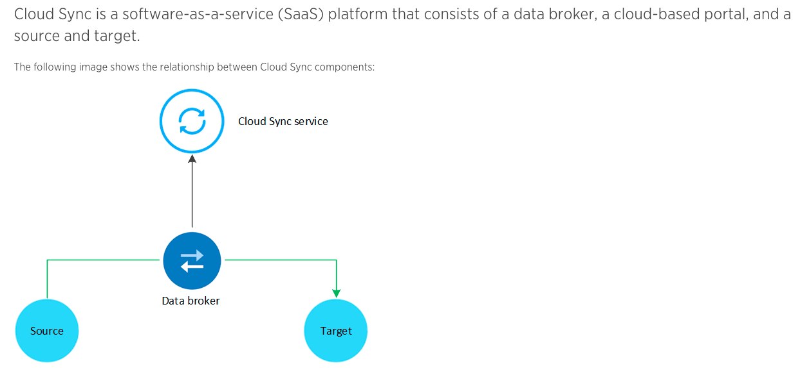

# cloud-sync-databroker-automation-samples
Samples of terraform files for CloudSync Data-Broker

## CloudSync Data-broker: 

## Create Data-Broker with Terraform:
###### terraform init
###### terraform plan -var stack_name=<DB_NAME> 
###### terraform apply -var stack_name=<DB_NAME>
